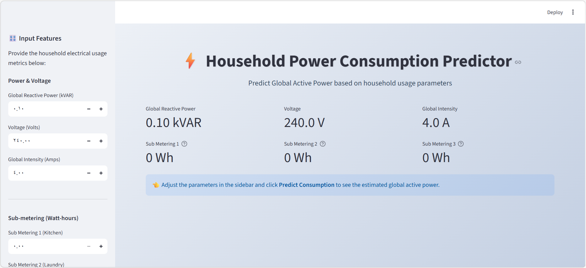

# Household Power Consumption Prediction

## Project Description
This project aims to predict household power consumption using a dataset of electrical usage. 
A Linear Regression model is used to estimate the actual consumed power (`Global_active_power`) 
based on features like Voltage, Global_intensity, and Sub_metering values.
 

## Project Files

| File | Description |
|------|-------------|
| data/household_power_consumption.txt | Main dataset from Kaggle |
| data_preparation.py | Function to load, clean, and prepare data |
| model.py | Build, train, evaluate the Linear Regression model |
| app.py | Streamlit web application interface |
| requirements.txt | Required Python packages |


## How to Run the Project

1. **Install the required libraries**  
   Before running the project, make sure all necessary Python libraries are installed.  
   You can install them using:

   ```bash
   pip install -r requirements.txt

 
2. **Run the model **
    to train the Linear Regression model and evaluate it, run:
    ```bash
    python model.py
    ```
   this will :
        Train the model on the dataset
        Predict power consumption on the test set
        Print the Mean Squared Error (MSE) and R² score
        Display a scatter plot showing the relationship between actual vs predicted power values

3. **Run the Streamlit UI**  
   To start the interactive web interface, open a terminal and run:
   ```bash
   streamlit run app.py
   ```

## Demo and Screenshots

**Demo Video:**  
[Watch here on Google Drive](https://drive.google.com/file/d/1OuyEFFNxwoe11hislYlm0Cz1Kpl9f3zz/view?usp=sharing)

**Screenshot:**  


## Dataset Source
the dataset used in this project is from kaggle:
[Household Power Consumption Dataset](https://www.kaggle.com/datasets/uciml/electric-power-consumption-data-set)
 

# Authored by Alaa Madi